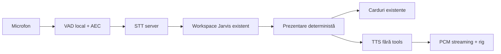

# Jarvis Voice

Voice este o interfață a aceluiași Jarvis Text. Pagina Text, memoria, istoricul, matchingul, routerul Luna/Sol, permisiunile, planurile și execuția rămân în core-ul existent.

Nu există registry, matching, planner sau handler CRM vocal. `existingJarvisCommand` trimite aceeași comandă și același ID de sesiune la `workspace`, inclusiv joburile existente. TTS primește numai textul scurt de citit, o conversație izolată și `tools: []`. STT transcrie; nu primește date din Firestore. Endpoint-urile audio folosesc autentificarea și verificarea proaspătă a membrului agenției. Colecțiile vocale sunt exclusiv metadate și limitare de utilizare.

## Activare și context

Ctrl+Space deschide/închide Voice pe desktop. Shortcut-ul ignoră input, textarea, select, contenteditable, editorii Monaco/CodeMirror și compunerea IME. Esc închide Voice; în formularul acordului închide întâi formularul. Launcherul folosește personajul compact, deasupra navigației mobile și a safe area; se ascunde la tastatura virtuală. Nu este un shortcut global al sistemului de operare.

ID-ul sesiunii comune este legat de UID și agenție în localStorage; conținutul CRM nu se pune acolo. Intrarea în Voice reîncarcă ultima prezentare și planul existent. Ieșirea reîmprospătează Text. Înregistrarea se oprește la ieșire, la demontarea componentei și la schimbarea actorului/agenției. Pagina ascunsă întrerupe redarea și oprește microfonul; reluarea se face explicit.

Voice nu afișează transcript, composer, istoric sau bule de chat. Cardurile, pașii, riscurile, costurile externe și confirmările apar în panoul contextual. Căutarea continuată și butonul CRM trimit aceleași query-uri existente, cu cursorul rezultatului. Acordul WhatsApp folosește componenta comună Text/Voice și același endpoint, cu checkbox și dovezi din apel. Un „Da” nu înregistrează acest acord.

## Audio și confirmări

AudioWorklet produce PCM mono; VAD filtrează zgomotele scurte, păstrează pre-roll și încheie vorbirea după 550 ms de liniște. Pragul pentru barge-in este 120 ms de vorbire susținută. La întrerupere se anulează requestul TTS, se opresc toate sursele deja programate și se acceptă noua comandă. Execuțiile CRM deja confirmate se verifică prin core; întreruperea sunetului nu promite anularea lor.

STT: `gpt-transcribe`, HTTP `/v1/audio/transcriptions`, română explicită și vocabular imobiliar generic. WAV strict 24 kHz/16 bit/mono, cel mult 30 secunde; streamul este limitat înainte de alocarea completă. Microfonul care returnează alt sample rate este convertit. TTS: `gpt-realtime-2.1-mini`, WebSocket Realtime, PCM 24 kHz, Cedar. Nu există cheie OpenAI în client.

Confirmarea vocală acceptă doar expresii izolate precum „Da”, „Confirm”, „Execută”, „Anulează”. Aprobarea este legată de planul deja prezentat la momentul comenzii. Două clickuri nu execută același plan de două ori. Rezultatul incert rămâne de verificat; componenta nu oferă reluare automată. Nu se citește întreaga listă de carduri. Prezentarea preferă 1–2 propoziții, totalurile exacte, prima oră și întrebarea de confirmare; rezultatele parțiale sunt numite parțiale.

## Configurație și operare

`JARVIS_VOICE_ENABLED=true` activează interfața în producție. `JARVIS_VOICE_AGENCIES` poate limita rollout-ul la o listă de ID-uri. `JARVIS_VOICE_NAME=cedar`; sunt acceptate și Marin/Coral. Demo este exclus. Flag-ul dezactivează numai Voice.

Limite audio: 30 cereri STT/TTS per minut per utilizator; implicit 1200/zi UTC, ajustabil prin `JARVIS_VOICE_DAILY_CALL_LIMIT` între 100 și 5000. Metadatele au un buget separat de 120 evenimente/minut. Limitele core Jarvis se aplică în continuare. Retry-ul audio nu reexecută un plan CRM.

`GET /api/ai-assistant/voice/metrics` returnează cele mai recente 1000 evenimente: p50/p95 STT, core, TTS și end-of-speech→audio, costuri estimate, minute STT/TTS, întreruperi și lungimea răspunsului. Agentul vede numai evenimentele sale; administratorul vede agenția. Fereastra incompletă este marcată. Costurile core sunt în endpoint-ul Text existent. Valorile clientului sunt orientative, nu factură de provider. Costul per minute închise este o estimare și nu include sesiuni încă deschise.

Audio raw este procesat în memorie și nu se persistă în CRM, Storage, loguri sau analytics. Nu există mod de arhivare audio activ. Textul comenzii se păstrează în conversația Jarvis existentă, ca în Text; transcriptul nu este afișat în interfața Voice. Metadatele nu conțin textul comenzii/răspunsului. Retenția furnizorului OpenAI depinde de setările contului; această implementare nu pretinde Zero Data Retention. Utilizatorul vede „Voce generată de AI”.

## Validare

`npx vitest run src/lib/jarvis-voice/__tests__`; `node scripts/jarvis-voice-ui-smoke.mjs`; `node scripts/ai-assistant-ui-smoke.mjs`; `node scripts/jarvis-rules-test.mjs`; `npm run typecheck`; `npm run build`. `node scripts/jarvis-voice-benchmark.mjs` face apeluri plătite pe texte sintetice, cu buget de maximum 0,50 USD, fără credențiale/date CRM.

Rezultate: [benchmark audio](VOICE_BENCHMARK.json), [UI și FPS](VOICE_UI_TESTS.json), [raportul cu 39 puncte](VOICE_REPORT.md). Testele cu microfon mock și loopback sintetic nu certifică accentul uman, AEC sau toate dispozitivele. Acceptanța finală pe microfon/difuzor real, Safari mobil și Electron se face prin scenariile din raport.
